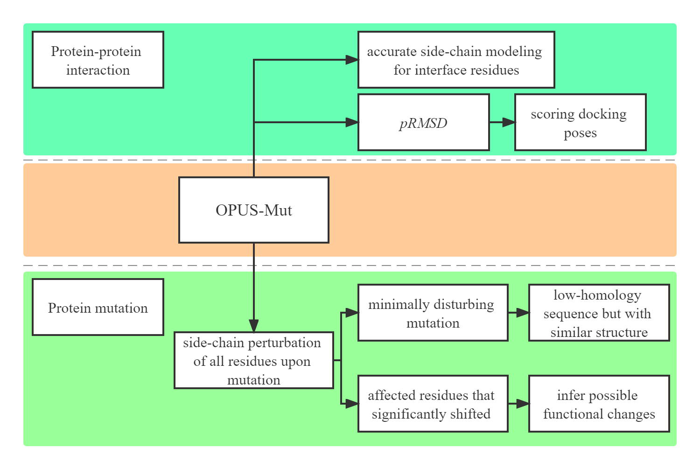

# OPUS-Mut

## Abstract for JCTC paper
Predicting the effect of protein mutation is crucial in many applications such as protein design, protein evolution, and genetic disease analysis. Structurally, the mutation is basically the replacement of the side chain of a particular residue. Therefore, accurate side-chain modeling is useful in studying the effect of mutation. Here, we propose a computational method, namely OPUS-Mut, which significantly outperforms other backbone-dependent side-chain modeling methods including our previous method OPUS-Rota4. We evaluate OPUS-Mut by four case studies on Myoglobin, p53, HIV-1 protease, and T4 lysozyme. The results show that the predicted structures of side chains of different mutants are consistent well with their experimentally determined results. In addition, when the residues with significant structural shifts upon the mutation are considered, it is found that the extent of the predicted structural shift of these affected residues can be correlated reasonably well with the functional changes of the mutant measured by experiments. OPUS-Mut can also help one to identify the harmful and benign mutations, and thus may guide the construction of a protein with relatively low sequence homology but with a similar structure.

## Abstract for BIB paper
Protein side chains are vitally important to many biological processes such as protein-protein interaction. In this study, we evaluate the performance of our previous released side-chain modeling method OPUS-Mut, together with some other methods, on three oligomer datasets, CASP14 (11), CAMEO-Homo (65), and CAMEO-Hetero (21). The results show that OPUS-Mut outperforms other methods measured by all residues or by the interfacial residues. We also demonstrate our method on evaluating protein-protein docking pose on a dataset Oligomer-Dock (75) created using the top 10 predictions from ZDOCK 3.0.2. Our scoring function correctly identifies the native pose as the top-1 in 45 out of 75 targets. Different from traditional scoring functions, our method is based on the overall side-chain packing favorableness in accordance with the local packing environment. It emphasizes the significance of side chains and provides a new and effective scoring term for studying protein-protein interaction.



## Usage

### Dependency

```
Python 3.7
TensorFlow 2.4
```

#### 1. Use `mk_mut_backbone.py` to generate original WT backbone file and mutants backbones.

In this step, you need to set the original PDB file path in line 97 `native_filepath = ./3phv.pdb`. Then set the mutations you want in line 108 `mutations =  ["P9Y", "V82I", "V82G", "I84N", "L90R"]`. Here, we use hiv.pdb and mutation Q2E as an example.

#### 2. List the backbone paths in `bb_list`.

`ls *bb > bb_list`

#### 3. Use `run_opus_mut.py` to generate the results of OPUS-Mut (.mut).

In this step, you need to activate the environment created by `mut.yml` file. Also, a GPU device is required and should be set in line 13 ` os.environ["CUDA_VISIBLE_DEVICES"] = "0" `. cuda10.1 is also required.

#### 4. Use `get_difference_summation.py` to calculate the differences between WT and mutants (.changes).

In this step, you need to set the original PDB file name in line 20 ` ori_name = "3phv"`, and line 115 ` if filename == "3phv": continue`. Note that, the code line 130 ` if not int(resid) in [25, 26, 27]: continue` can be used to calculate the differences from specific residues (Sdiff_critical). When calculating the differences from all residues (Sdiff), you need to comment this line, and also uncomment the line between 134-143 to avoid the influence of outliers.
.

### Download

The standalone version of OPUS-Mut is hosted on [Baidu Drive](https://pan.baidu.com/s/1brB2or5aXgFJjCKRdymHlQ) with password `st5x`. It can also be downloaded from [Here](https://drive.google.com/file/d/1ZpFjghkqP5vsIpOk1bYwFyhci7FeNPPD/view?usp=sharing).

Three datasets (CASP14, CAMEO60, and CAMEO65) with single peptide chain can be downloaded directly from [Here](https://github.com/thuxugang/opus_mut/blob/main/opus_mut_datasets.zip).

Three oligomer datasets (CASP14 (11), CAMEO-Homo (65), and CAMEO-Hetero (21)) and the protein-protein docking pose dataset Oligomer-Dock (75) are hosted on [Baidu Drive](https://pan.baidu.com/s/1Esb9_io-XlZMR1UlOXqCMA) with password `wnq4`.


## Reference 
```bibtex
@article{xu2022opus1,
  title={Studying protein–protein interaction through side-chain modeling method OPUS-Mut},
  author={Xu, Gang and Wang, Yilin and Wang, Qinghua and Ma, Jianpeng},
  journal={Briefings in Bioinformatics},
  year={2022},
  publisher={Oxford University Press}
}
@article{xu2023opus1,
  title={OPUS-Mut: Studying the Effect of Protein Mutation through Side-Chain Modeling},
  author={Xu, Gang and Wang, Qinghua and Ma, Jianpeng},
  journal={Journal of Chemical Theory and Computation},
  year={2023},
  publisher={ACS Publications}
}
```
